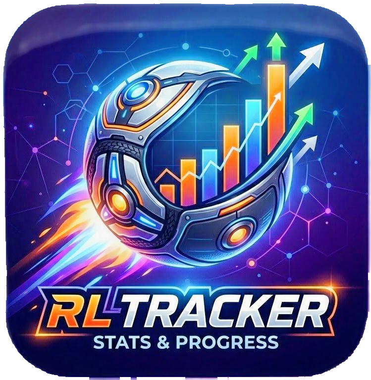
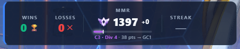
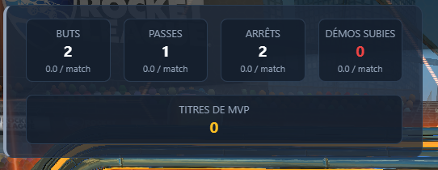
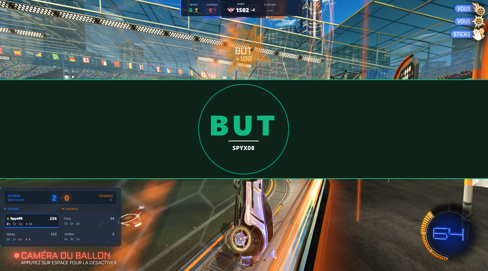
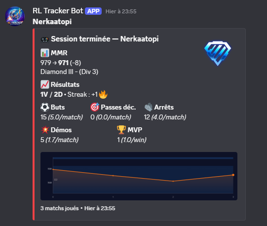

  
  <h1>RL Tracker — Overlay Rocket League</h1>

RL Tracker est un overlay desktop pour Rocket League qui affiche tes statistiques en temps réel directement par-dessus le jeu, sans jamais interrompre ta partie.

  

### Ce que ça fait

- 📊 **HUD** — visualise ton MMR, tes wins/losses et ta streak en un coup d'œil

  

- 📈 **Session Stats** — suis ta progression sur l'ensemble de ta session de jeu

  

- 🎮 **Live Game** — informations en direct sur la partie en cours, avec animations sur les événements clés (buts, etc.)

  

- 📣 **Résumé Discord** — à la fin de chaque session, un récapitulatif complet (MMR, résultats, stats, graphique de progression) est automatiquement posté sur le webhook Discord de ton choix.

  

### Comment ça marche

L'application se superpose à Rocket League de manière totalement transparente : tous tes clics et mouvements de souris passent directement au jeu, sans aucun impact sur tes inputs ou tes performances. En **mode édition**, tu peux activer/désactiver chaque panneau individuellement et les repositionner librement à l'écran. Une fois en jeu, l'overlay est verrouillé et invisible pour ta souris.

Les mises à jour sont gérées automatiquement en arrière-plan — tu reçois une notification dans l'app dès qu'une nouvelle version est disponible.

---

## Téléchargement & Installation

### 1. Télécharger l'installeur

Rends-toi sur la page des [**Releases**](https://github.com/spyx08/rl-tracker/releases) du dépôt.

Clique sur la dernière version (en haut de la liste), puis télécharge le fichier **`RL-Overlay-Setup-x.x.x.exe`** dans la section **Assets**.

> Si tu vois un avertissement Windows du type *"Windows a protégé votre PC"*, clique sur **Informations complémentaires** puis **Exécuter quand même**. C'est normal pour une application non signée.

### 2. Installer

Lance le fichier `.exe` téléchargé. L'installation est automatique (one-click), l'app démarre directement après.

### 3. Configurer Rocket League

#### Mode d'affichage

Pour que l'overlay s'affiche par-dessus le jeu, Rocket League doit être en **mode fenêtre sans bordure** :

Dans le jeu : **Paramètres → Vidéo → Mode d'affichage → Fenêtre sans bordure**

*(Display Mode → Windowed Fullscreen en anglais)*

#### Activer les statistiques en temps réel

L'overlay a besoin des données de stats envoyées par le jeu. Tu dois modifier un fichier de configuration Rocket League :

1. Ouvre l'explorateur de fichiers et navigue vers le dossier d'installation de Rocket League.
   - **Localisation typique** : `C:\Program Files (x86)\Steam\steamapps\common\rocketleague`

2. Ouvre le fichier : **`TAGame\Config\DefaultStatsAPI.ini`**

3. Cherche la ligne `PacketSendRate=0` et change-la en `PacketSendRate=2`

4. **Sauvegarde le fichier** et redémarre le jeu.

> ℹ️ Si tu ne fais pas cette modification, l'overlay s'affichera mais ne recevra pas les événements du jeu (buts, stats, MMR).

---

## Utilisation

- Lance l'application via le raccourci créé à l'installation.
- Un **bouton ⚙** en haut à droite permet d'ouvrir le panneau de configuration.
- En **mode édition**, tu peux déplacer chaque panneau librement à l'écran.
- Hors mode édition, la fenêtre est entièrement **transparente aux clics** — tu joues normalement.

### Mises à jour

L'application vérifie les mises à jour automatiquement au démarrage. Quand une mise à jour est disponible, une notification apparaît dans le menu ⚙. Il suffit de cliquer sur **"Installer et redémarrer"**.

---

## Désinstallation

**Paramètres Windows → Applications → RL Overlay → Désinstaller**

---

## Problèmes fréquents

**L'overlay ne s'affiche pas par-dessus le jeu**
→ Vérifie que Rocket League est bien en mode **Fenêtre sans bordure** (pas Plein écran).

**Le serveur apparaît comme déconnecté (point rouge dans le menu ⚙)**
→ Attends quelques secondes au démarrage, le serveur interne met 1 à 2 secondes à démarrer.
→ Si le problème persiste, clique sur **"Ouvrir les logs"** dans le menu ⚙ et partage le fichier `server.log`.

**Windows bloque l'installation**
→ Voir la note dans la section [Téléchargement](#1-télécharger-linstalleur) ci-dessus.
