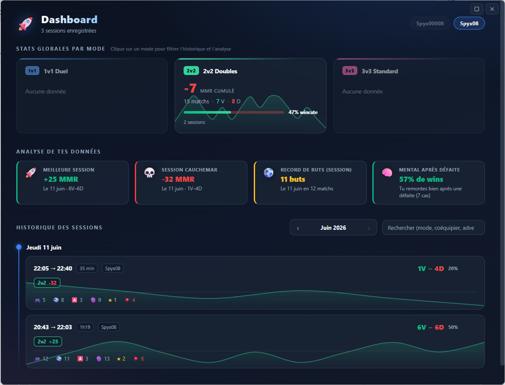
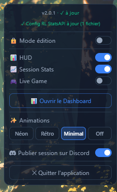

  
  <h1>RL Tracker — Overlay Rocket League</h1>

RL Tracker est un overlay desktop pour Rocket League qui affiche tes statistiques en temps réel directement par-dessus le jeu, sans jamais interrompre ta partie — et qui garde l'historique de toutes tes sessions pour analyser ta progression.

  

### Ce que ça fait

- 📊 **HUD** — visualise ton MMR, tes wins/losses et ta streak en un coup d'œil, avec une barre de progression dans ta division actuelle (points restants jusqu'à la division suivante et repère de ton MMR de début de session)

  

- 📈 **Session Stats** — suis ta progression sur l'ensemble de ta session de jeu

  

- 🎮 **Live Game** — informations en direct sur la partie en cours, avec animations sur les événements clés (buts, victoires). Trois thèmes d'animations au choix — **Néon**, **Rétro** (arcade CRT) et **Minimal** — sélectionnables depuis le menu ⚙, ou désactivables complètement.

  

- 📅 **Dashboard** — toutes tes sessions sont enregistrées en local. Une fenêtre dédiée (accessible depuis le menu ⚙) affiche tes stats globales par mode de jeu (1v1 / 2v2 / 3v3), une analyse de tes données (meilleure tranche horaire, jour le plus rentable, séries record, détecteur de tilt…) et l'historique complet de tes sessions sous forme de timeline, navigable mois par mois avec recherche.

  

- 📣 **Résumé Discord** — à la fin de chaque session, un récapitulatif complet (MMR, résultats, stats, graphique de progression) est automatiquement posté sur le webhook Discord de ton choix.

  

### Comment ça marche

L'application se superpose à Rocket League de manière totalement transparente : tous tes clics et mouvements de souris passent directement au jeu, sans aucun impact sur tes inputs ou tes performances. En **mode édition**, tu peux activer/désactiver chaque panneau individuellement et les repositionner librement à l'écran. Une fois en jeu, l'overlay est verrouillé et invisible pour ta souris.

Les mises à jour sont gérées automatiquement en arrière-plan — tu reçois une notification dans l'app dès qu'une nouvelle version est disponible.

---

## Téléchargement & Installation

### 1. Télécharger l'installeur

Rends-toi sur la page des [**Releases**](https://github.com/spyx08/rl-tracker/releases) du dépôt.

Clique sur la dernière version (en haut de la liste), puis télécharge le fichier **`RL-Overlay-Setup-x.x.x.exe`** dans la section **Assets**.

> Si tu vois un avertissement Windows du type _"Windows a protégé votre PC"_, clique sur **Informations complémentaires** puis **Exécuter quand même**. C'est normal pour une application non signée.

### 2. Installer

Lance le fichier `.exe` téléchargé. L'installation est automatique (one-click), l'app démarre directement après.

### 3. Configurer Rocket League

#### Mode d'affichage

Pour que l'overlay s'affiche par-dessus le jeu, Rocket League doit être en **mode fenêtre sans bordure** :

Dans le jeu : **Paramètres → Vidéo → Mode d'affichage → Fenêtre sans bordure**

_(Display Mode → Windowed Fullscreen en anglais)_

#### Activer les statistiques en temps réel

L'overlay a besoin des données de stats envoyées par le jeu (`PacketSendRate=2` dans `TAGame\Config\DefaultStatsAPI.ini`).

**C'est automatique** : à chaque lancement, l'app détecte tes installations de Rocket League (Steam **et** Epic Games, y compris les bibliothèques Steam secondaires) et corrige le fichier si nécessaire. Si le fichier est protégé par Windows, une invite UAC te demandera de valider la correction. Le statut de la configuration est visible dans le menu ⚙.

> ℹ️ Si le jeu était lancé pendant la correction, redémarre-le pour qu'elle soit prise en compte.

Faire la modification manuellement (si besoin)

1. Ouvre l'explorateur de fichiers et navigue vers le dossier d'installation de Rocket League.
   - **Localisation typique** : `C:\Program Files (x86)\Steam\steamapps\common\rocketleague`

2. Ouvre le fichier : **`TAGame\Config\DefaultStatsAPI.ini`**

3. Cherche la ligne `PacketSendRate=0` et change-la en `PacketSendRate=2`

4. **Sauvegarde le fichier** et redémarre le jeu.

---

## Utilisation

- Lance l'application via le raccourci créé à l'installation.
- Un **bouton ⚙** en haut à droite permet d'ouvrir le panneau de configuration.

  

- En **mode édition**, tu peux déplacer chaque panneau librement à l'écran.
- Hors mode édition, la fenêtre est entièrement **transparente aux clics** — tu joues normalement.

Depuis le menu ⚙ tu peux aussi :

- **Ouvrir le Dashboard** — la fenêtre d'historique et d'analyse de tes sessions.
- **Changer le thème des animations** (Néon / Rétro / Minimal) ou les désactiver (Off).
- Vérifier le **statut de la config Rocket League** (StatsAPI) et du serveur interne.
- Activer/désactiver la **publication du résumé de session sur Discord**.

### Mises à jour

L'application vérifie les mises à jour automatiquement au démarrage. Quand une mise à jour est disponible, une notification apparaît dans le menu ⚙. Il suffit de cliquer sur **"Installer et redémarrer"**.

---

## Désinstallation

**Paramètres Windows → Applications → RL Overlay → Désinstaller**

---

## Problèmes fréquents

**L'overlay ne s'affiche pas par-dessus le jeu**
→ Vérifie que Rocket League est bien en mode **Fenêtre sans bordure** (pas Plein écran).

**L'overlay s'affiche mais ne reçoit aucune stat (buts, MMR…)**
→ Ouvre le menu ⚙ et vérifie la ligne de statut **Config RL StatsAPI**. Si elle indique une erreur, relance l'app (et valide l'invite UAC si elle apparaît), ou fais la modification manuellement (voir [Configurer Rocket League](#activer-les-statistiques-en-temps-réel)).

**Le serveur apparaît comme déconnecté (point rouge dans le menu ⚙)**
→ Attends quelques secondes au démarrage, le serveur interne met 1 à 2 secondes à démarrer.
→ Si le problème persiste, clique sur **"Ouvrir les logs"** dans le menu ⚙ et partage le fichier `server.log`.

**Windows bloque l'installation**
→ Voir la note dans la section [Téléchargement](#1-télécharger-linstalleur) ci-dessus.
